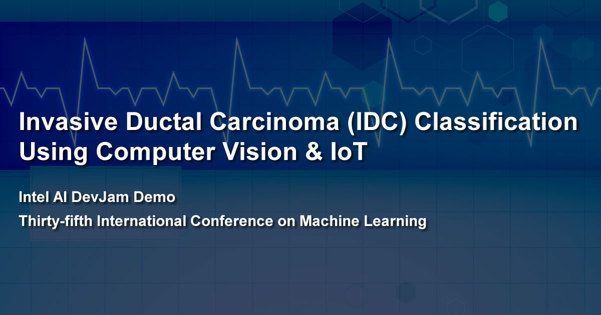
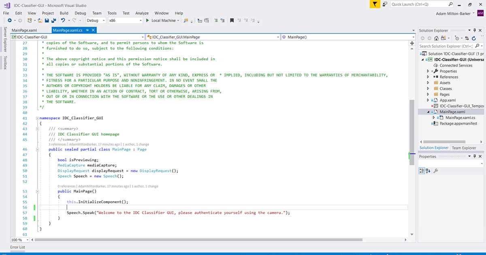
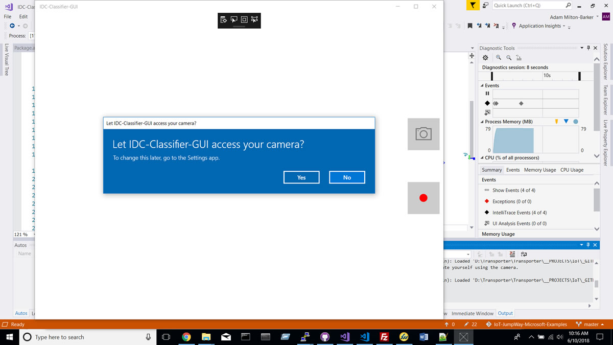

# Invasive Ductal Carcinoma (IDC) Classification Using Computer Vision & IoT
## Intel AI DevJam Demo GUI

## Introduction

The **Intel AI DevJam Demo GUI** project provides the source codes and tutorials for setting up the same project that will demonstrated at **Intel AI DevJam** at **ICML** (**International Conference on Machine Learning**) in **Sweden**, July 2018.

The **Intel® AI DevJam Demo GUI** uses a **Windows application** to communicate with a **facial recognition classifier** and a classifier trained to detect **Invasive Ductal Carcinoma (Breast cancer)** in **histology images**.

## IoT Connectivity

**IoT connectivity** for the project is provided by the [IoT JumpWay](https://www.iotjumpway.tech "IoT JumpWay"). The **IoT JumpWay** is an **IoT communication** platform as a service (PaaS) with a social network frontend. IoT JumpWay developers will soon be able to share projects/photos/videos and events. Use of the IoT JumpWay is completely free, you can find out more on the [Developer Program](https://iot.techbubbletechnologies.com/developers/ "Developer Program") page.

## Checklist

Make sure you have completed the following steps before continuing to configure the Universal Windows Application. 

- Setup the [IDC classification server/API](https://github.com/iotJumpway/IoT-JumpWay-Microsoft-Examples/tree/master/Intel-AI-DevJam-IDC/IDC-Classifier "IDC classification server/API").

- Setup the [IoT alarm device](https://github.com/iotJumpway/IoT-JumpWay-Microsoft-Examples/tree/master/Intel-AI-DevJam-IDC/Dev-Kit-IoT-Alarm "IoT alarm device").

## Software Requirements

- [Microsoft Visual Studio 2017](https://www.visualstudio.com/downloads/ "Microsoft Visual Studio 2017")

## Setting Up The Universal Windows Application

You should have already downloaded the repository source code when you completed the [IDC classification server/API](https://github.com/iotJumpway/IoT-JumpWay-Microsoft-Examples/tree/master/Intel-AI-DevJam-IDC/IDC-Classifier "IDC classification server/API") setup. Navigate to **IoT-JumpWay-Microsoft-Examples/Intel-AI-DevJam-IDC** and double click the **IDC-Classifier-GUI.sln** file to open the solution in **Visual Studio 2017**.

## Testing The Universal Windows Application

You can test that the project is able to access your camera by pressing the run button in the Visual Studio main toolbar. This will first check for permissions and then display the camera stream in the GUI.

**Get Involved** 
This project is open sourced under the MIT license. All contributions are welcome, you can choose from any of the features list below or submit your own features for review via a pull request. 

**Features List** 
Below you will find any features that will be implemented. Pull requests are welcome.

**KNOWN BUGS** 
Below you will find all known bugs in the application. Each bug has a corresponding issue in the repo issues area. Pull requests are welcome.

- [KNOWN BUG: Crashes after permissions](https://github.com/iotJumpway/IoT-JumpWay-Microsoft-Examples/issues/1 "KNOWN BUG: Crashes after permissions")

## Bugs/Issues

Please feel free to create issues for bugs and general issues you come across whilst using this or any other IoT JumpWay Microsoft repo issues: [IoT-JumpWay-Microsoft-Examples Github Issues](https://github.com/iotJumpway/IoT-JumpWay-Microsoft-Examples/issues "IoT-JumpWay-Microsoft-Examples Github Issues")

## Contributors

