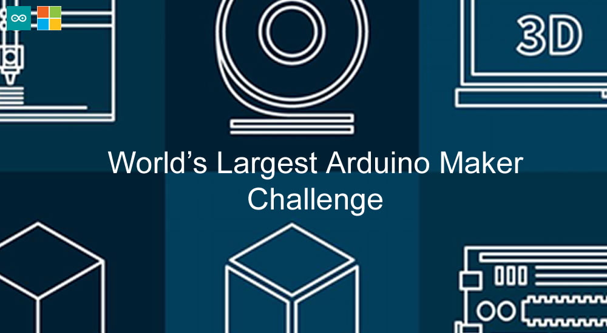

# World’s Largest Arduino Maker Challenge

Source code repository for Hackster/Microsoft/Arduino World’s Largest Arduino Maker Challenge competition entry.

This project consists of three devices:

- 1 x Windows Universal Application (TIA)
- 1 x MKR1000 (DoorGuard1000)
- 2 x Arduino Uno boards (AuthWayNFC & AuthWayFP)

Two Arduino Uno boards are used for authentication to the Windows application and the MKR1000 is an IoT security device. The Arduino Uno boards communicate with the Windows Application using serial, the MKR1000 is a web server and the Windows Application controls it and reads sensor data via HTTP.

The Windows Universal application is a Weak Artificial Intelligence application using SIML - the Synthetic Intelligence Markup Language. The Windows application is programmed in C# and also uses speech recognition and speech synthesis.

FOR FULL TUTORIAL PLEASE CHECK OUT THE HACKSTER PROJECT PAGE:

https://www.hackster.io/AdamMiltonBarker/tia-weak-artificial-intelligence-iot-assistant-e440cf
